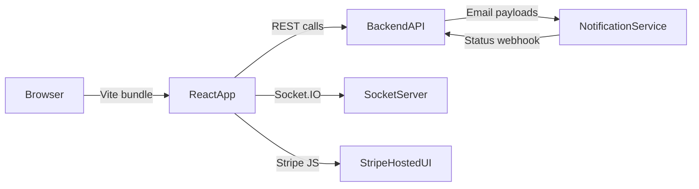
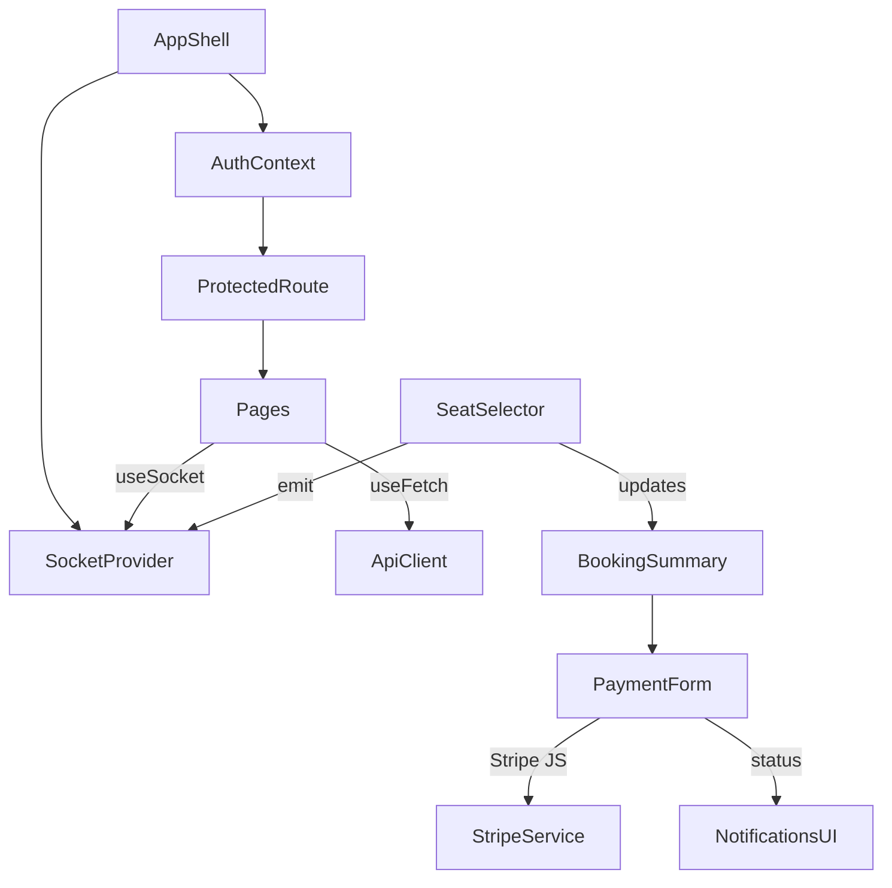
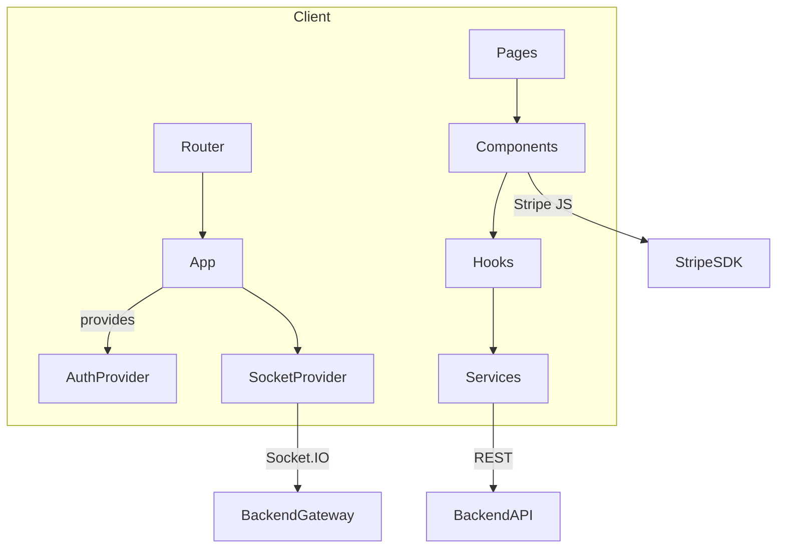
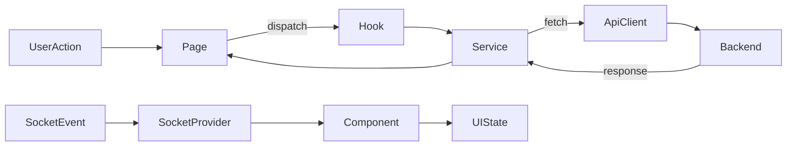
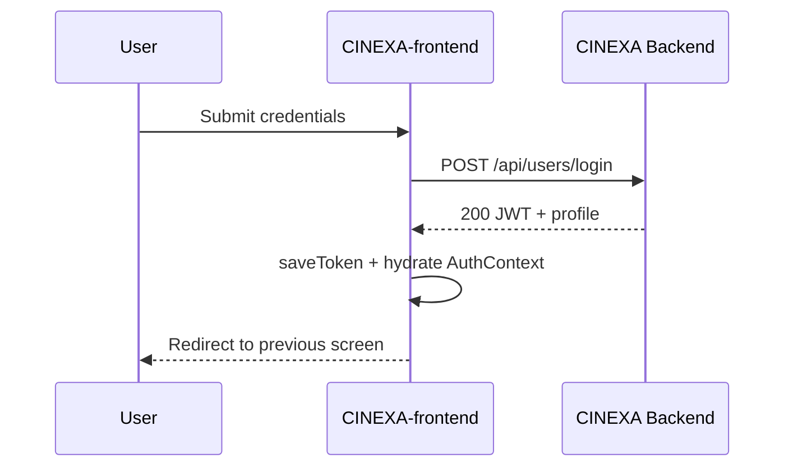
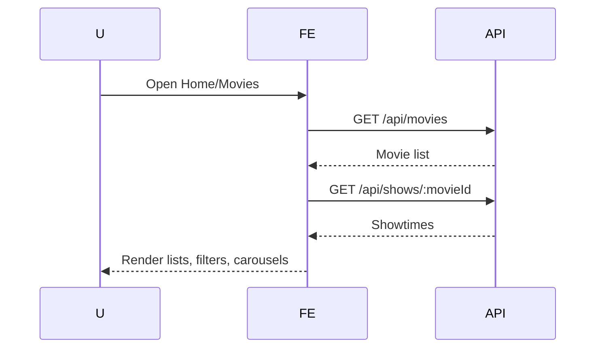
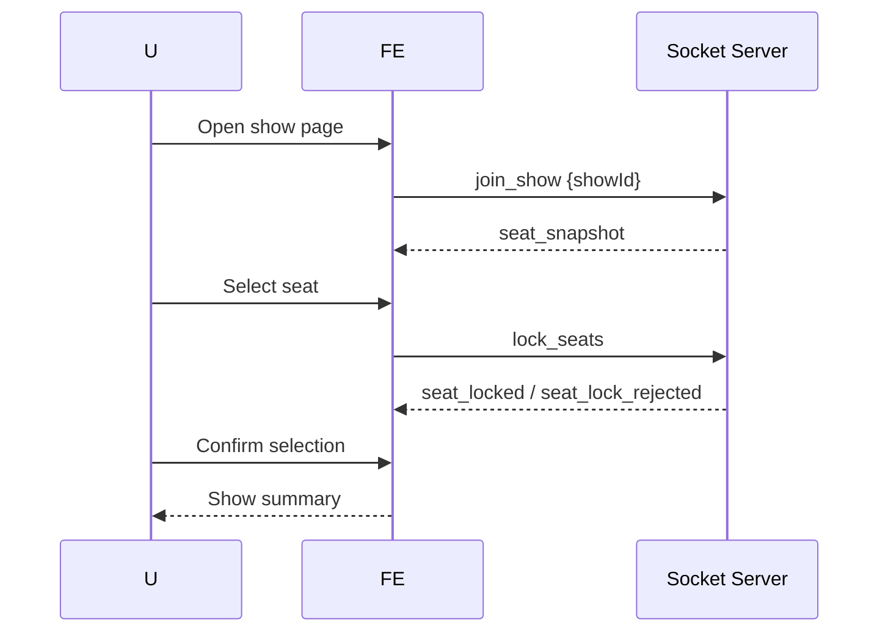
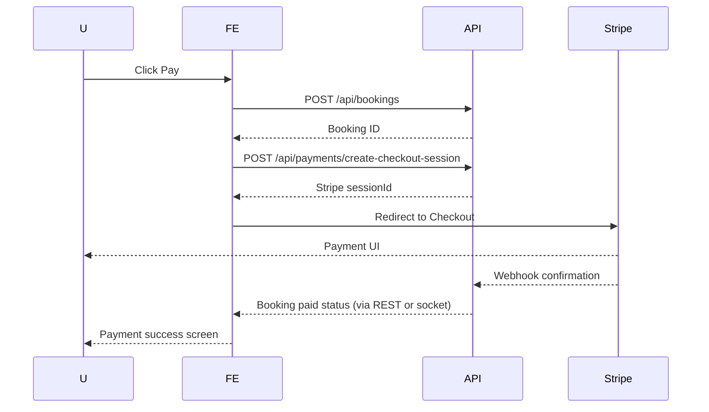
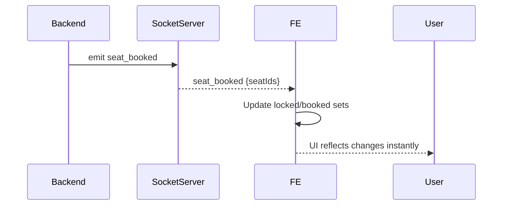
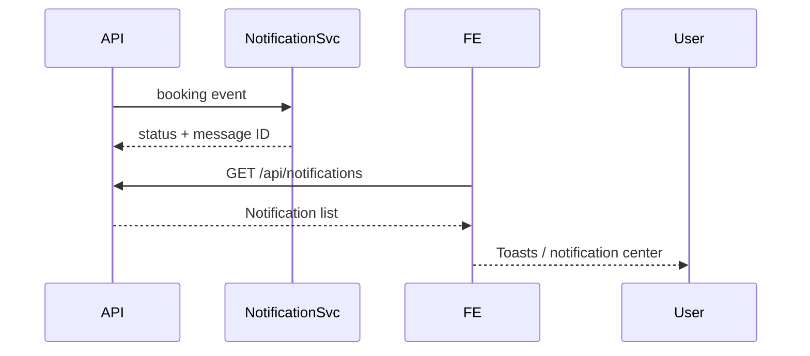

# CINEXA-frontend
> Cinexa frontend — browse, book, and pay with real-time seat updates.

**Repositories**
- Core backend/API: https://github.com/jatin-sh01/CINEXA.git
- Frontend SPA: https://github.com/jatin-sh01/CINEXA-frontend.git
- Notification service: https://github.com/jatin-sh01/NotifiactionService.git

CINEXA-frontend is the customer-facing React single-page application that powers the Cinexa movie ticket booking experience. Users can discover movies, pick theaters and showtimes, select seats alongside other viewers via Socket.IO updates, and complete checkout through Stripe—all while the app syncs with the CINEXA backend/API and the notification service that issues booking confirmation emails and alerts.

## Table of Contents
1. [Overview](#overview)
2. [High-Level Design (HLD)](#high-level-design-hld)
3. [Low-Level Design (LLD)](#low-level-design-lld)
4. [Quick Start](#quick-start)
5. [Repository Layout](#repository-layout)
6. [Environment Variables](#environment-variables)
7. [Architecture](#architecture)
8. [Service Overview](#service-overview)
9. [API / Event Flow Overview](#api--event-flow-overview)
10. [Scripts & Running](#scripts--running)
11. [Testing](#testing)
12. [Project Structure](#project-structure)
13. [Deployment](#deployment)
14. [Timeline](#timeline)
15. [Open Items](#open-items)

## Overview
- CINEXA-frontend delivers the full customer journey for browsing catalogs, checking availability, locking seats, and paying securely.
- Targeted at end users booking tickets via web and admins reviewing bookings via dedicated views.
- Solves discoverability, seat availability transparency, and frictionless payments with live updates and saved sessions.
- Communicates exclusively with the CINEXA backend/API for movies, shows, bookings, payments, and notifications; this repository does not contain backend or notification processing code.
- Participates in payment and notification visibility by:
  - initiating Stripe payment intents/checkout sessions and rendering forms via Stripe JS.
  - listening for backend Socket.IO events (seat locks, releases, confirmations).
  - polling/receiving booking state and displaying notification summaries triggered by the NotificationService repository.

## High-Level Design (HLD)
CINEXA-frontend is a Vite + React SPA that orchestrates routing, data fetching, and realtime updates.



### Frontend Goals
- Deliver responsive, accessible, mobile-friendly UX.
- Provide deterministic seat selection with conflict resolution.
- Surface booking and payment status quickly.
- Keep client concerns isolated from backend logic for maintainability.

### Core Screens
Home, Movies list, Movie details, Show page, Seat selection, Checkout, Booking summary, Profile, Admin dashboards, Notifications.

### Global App Flow
React Router bootstraps layout → Auth state hydrates from storage → data fetched via API service → pages render with Tailwind components → seat events streamed over Socket.IO → payments handled through Stripe JS modals/forms.

### API Integration Model
`apiClient` centralizes REST calls with retry/backoff, caching for GET, and token attachment. Feature hooks/pages consume typed service functions.

### Realtime Integration
`SocketProvider` opens a client connection to the backend gateway, authenticates with JWT, and exposes `emit/on/joinRoom/leaveRoom` helpers. Seat selectors and booking widgets subscribe to push updates.

### Stripe JS Interaction
`stripeClient` loads publishable key, while `paymentService` orchestrates creating/confirming checkout sessions and intents before redirecting to Stripe-hosted flows and reconciling status.

### Authentication / Session State
`AuthContext` persists JWT in storage, decodes claims, refreshes in-memory state, and guards routes. Protected routes check role claims before rendering.

### Scalability & Maintainability
- Modular folders (`components`, `pages`, `hooks`, `services`, `contexts`).
- Tailwind utility classes for design consistency.
- Shared UI patterns for cards/tables.
- Socket isolation prevents race conditions and simplifies testing.

#### UI Layer
Composable components (Hero sliders, movie cards, seat selector, tables) styled via Tailwind, Framer Motion, and Swiper for carousels.

#### State Management
React context + hooks for auth, socket, paginated fetch, admin-specific logic; local component state for seat grids and filters.

#### Routing
React Router DOM handles nested layouts, protected routes, and admin pages.

#### Real-Time Updates
Socket provider dispatches seat lock/release/booked events to components; reconnect logic ensures resiliency.

#### External Integrations
Stripe JS for payments, Socket.IO for live updates, backend REST for data, react-icons for glyphs.

## Low-Level Design (LLD)
### Component Structure
- Presentational components in [src/components](src/components) (e.g., MovieCard, SeatSelector, AuthModal).
- Domain-specific components under [src/components/admin](src/components/admin) and [src/components/auth](src/components/auth) for respective flows.

### Routing Structure
- Defined in [src/main.jsx](src/main.jsx) and page modules under [src/pages](src/pages).
- Public routes: Home, MoviesList, MovieDetails, ShowPage, login/register modals.
- Protected routes: BookingSummary, Payment pages, Profile, Admin panel via `ProtectedRoute`.

### Page Responsibilities
- Home: hero slider, featured rows, CTA to browse.
- MoviesList: filtering, pagination, search.
- MovieDetails: showtimes, metadata, call-to-action.
- ShowPage: seat selector, pricing, summary sidebar.
- BookingDetail/BookingSummary: review seats, pricing, notifications.
- Admin pages: dashboards, moderation, user role editing.

### Reusable Components
Buttons, cards, sliders, tables, forms, Toast, Modal, ContentModal, CinexaLogo, EmptyState.

### Hooks
- `useFetch`, `usePaginatedFetch`, `useHomeData`: encapsulate REST calls.
- `useAdminAuth`, `useSocket`: domain-specific logic.
- `useSocket` consumes provider and throws if misused.

### Context & State Handling
- `AuthContext` stores user, token, roles.
- `SocketContext` exposes connection utilities.
- Additional contexts (e.g., `modalContent`) centralize shared UI state.

### API Service Layer
- [src/services/apiClient.js](src/services/apiClient.js) handles base URL resolution, retries, caching, error normalization.
- [src/api.js](src/api.js) exports helper methods used by contexts/services.

### Form Handling
Tailwind-styled forms with controlled inputs in Auth, Search, Payment components; validation handled in component-level logic and backend responses.

### Seat Selection Logic
[SeatSelector](src/components/SeatSelector.jsx) renders seats grid, tracks `selected`, `locked`, `booked` sets, joins show-specific socket rooms, emits lock/release events, and reconciles server snapshots.

### Auth Handling
Auth modal + `LoginCard`/`RegisterCard` call `/api/users/login|register`, store JWT via `utils/storage`, and refresh context state. Reset password uses `/api/users/reset-password`.

### Protected Routes
`ProtectedRoute` inspects `useAuth()` for loading state and role flags before rendering the wrapped component or redirecting.

### Client-Side Payment Flow
[paymentService](src/services/paymentService.js) ensures auth token presence, hits payment endpoints, normalizes errors, and caches pending payment metadata in sessionStorage. [stripeClient](src/services/stripeClient.js) loads publishable key for Stripe Elements.

### Socket.IO Event Handling
`SocketProvider` registers seat events; `SeatSelector` subscribes to `seat_snapshot`, `seat_locked`, `seat_released`, `seat_booked`, and `seat_lock_rejected`. Booking views listen for booking confirmation events.

### Notification Display
Toast and notification widgets retrieve notification feed via `/api/notifications` and render statuses, aligning with backend + NotificationService output.



## Quick Start
**Prerequisites**
- Node.js ≥ 18 (Assumption; align with Vite requirements)
- npm ≥ 9
- Access to CINEXA backend/API and notification services
- Stripe publishable key

**Setup**

```bash
git clone https://github.com/cinexa/CINEXA-frontend.git
cd CINEXA-frontend/cinexa-frontend
cp .env.example .env                # create and edit if template exists (TODO)
npm install
npm run dev
```

- `.env` should live alongside `package.json`. Create manually if `.env.example` is absent.
- Ensure backend (`CINEXA` repo) and notification service are running for end-to-end flows.

## Repository Layout
- `src/pages`: route-level views (Home, Movies, Shows, Booking, Admin, Auth, etc.).
- `src/components`: shared UI elements (modals, lists, cards) plus domain subfolders (admin, auth, booking, shared, theaters).
- `src/hooks`: data fetching, pagination, sockets, admin auth helpers.
- `src/services`: API client, payment helpers, Stripe loader, adapters.
- `src/contexts`: Auth, Socket, UI contexts.
- `src/layouts`: Layout shells such as `AdminLayout`.
- `src/utils`: formatters, socket event constants, storage helpers.
- `src/data`: static seed data (e.g., featured movies).
- `src/assets` / styles: Tailwind setup in `App.css`, `index.css`, `admin-theme.css`.
- Integrates with CINEXA backend (REST + Socket.IO) and NotificationService for outbound alerts.

## Environment Variables
| Variable | Required | Description | Example |
| --- | --- | --- | --- |
| `VITE_API_BASE_URL` | Yes | Base URL for CINEXA backend REST + Socket.IO (falls back to localhost if absent). | `https://api.cinexa.com` |
| `VITE_SOCKET_URL` | Optional | Explicit Socket.IO endpoint (assumption; defaults to API URL if unset). | `https://socket.cinexa.com` |
| `VITE_STRIPE_PUBLISHABLE_KEY` | Yes | Stripe publishable key for Elements/Checkout. | `pk_live_...` |
| `VITE_ENV` | Optional | Environment label used for logging/feature flags (assumption). | `production` |
| `VITE_SENTRY_DSN` | Optional | Monitoring DSN for error tracking (TODO integrate). | `https://...@sentry.io/...` |
| `VITE_API_DEBUG` | Optional | Enables verbose API logging in `apiClient`. | `true` |

If additional variables emerge (e.g., analytics keys), document them alongside defaults.

## Architecture
The app separates UI, state, network, and real-time responsibilities for clarity.

1. **React Structure**: `main.jsx` mounts `App` with `AuthProvider`, `SocketProvider`, and `BrowserRouter`. Feature modules import shared UI patterns and hooks.
2. **Backend Consumption**: `apiClient` issues REST calls with bearer tokens and retries.
3. **Realtime Updates**: Socket provider listens to seat/booking rooms; UI components subscribe/unsubscribe dynamically.
4. **Stripe Usage**: `stripeClient` loads the publishable key, and payment flows call backend endpoints before invoking Stripe-hosted UI.
5. **State Types**:
   - UI State: managed in components/hooks (filters, modals, seat selections).
   - Server State: normalized responses cached per request; invalidated on user actions.
6. **Data Flow**: Requests originate from pages, pass through services/hooks, and update contexts; sockets push changes back to components.





## Service Overview
### Routing and Views
- Public routes: Landing, movie discovery, show details, theaters.
- Auth routes: login/register/reset modals accessible anywhere via `AuthModal`.
- Protected routes: bookings, payments, profile, admin dashboards; enforced via `ProtectedRoute`.
- Scroll restoration handled by `ScrollToTop`.

### Browsing Movies and Showtimes
- `HeroSlider`, `MovieRow`, `Filters` components fetch data via `useHomeData` and `usePaginatedFetch`.
- Users can filter by genre/date/venue, with caches to prevent redundant requests.

### Seat Selection and Booking Flow
- `SeatSelector` renders seat grid, locks seats via `lock_seats`, responds to `seat_snapshot/seat_booked` events, and keeps selection synchronized.
- Booking summary cards show pricing, selected seats, and call Stripe flows.
- Conflict handling: locked seats appear amber; booked seats are red/disabled; selection resets if `seat_lock_rejected`.

### Auth / Session Handling
- `LoginCard`/`RegisterCard` call `/api/users/login|register`.
- Tokens saved in `utils/storage`, mirrored into `apiClient` and `AuthContext`.
- Logout clears in-memory + persisted tokens; expired tokens detected via JWT `exp`.

### Socket.IO Usage
- Connection established once via `SocketProvider`, authenticated with JWT.
- Seat components join show rooms; booking components listen for `booking_status` events.
- Reconnections attempt with exponential delay; manual cleanup occurs on unmount.

### Stripe Client-Side Flow
- Payment forms load Stripe Elements with `VITE_STRIPE_PUBLISHABLE_KEY`.
- Backend endpoints create checkout sessions or payment intents; success URLs handled in `PaymentSuccess` page which reconciles server state.
- Errors normalized for UI display; pending payments cached to resume after redirects.

## API / Event Flow Overview
### Signup / Login Flow


### Browse Movies and Shows Flow


### Seat Selection Flow


### Checkout / Payment Flow


### Realtime Seat Update Flow


### Notification Display Flow


## Scripts & Running
| Command | Description |
| --- | --- |
| `npm install` | Install dependencies. |
| `npm run dev` | Start Vite dev server with hot reload. |
| `npm run build` | Create production build. |
| `npm run preview` | Preview the production build locally. |
| `npm run lint` | Run ESLint across the project. |
| _Tests_ | No `npm test` script defined yet (see [Testing](#testing)). |

## Testing
- Current status: no automated tests shipped.
- Recommended coverage:
  - **Unit/Component**: Vitest + React Testing Library for components such as `SeatSelector`, forms, and modals.
  - **Integration**: Mock `apiClient` and `SocketProvider` to test flows (booking, seat locking).
  - **E2E**: Cypress to simulate browsing, selecting seats, and completing payments against staging APIs.
  - **Visual/Accessibility**: Storybook or Chromatic visual regression and axe audits.

## Project Structure
```
cinexa-frontend/
├── package.json
├── vite.config.js
├── public/
└── src/
    ├── api.js
    ├── App.jsx / App.css
    ├── main.jsx / index.css
    ├── components/
    │   ├── AuthModal.jsx
    │   ├── SeatSelector.jsx
    │   ├── admin/
    │   ├── auth/
    │   ├── booking/
    │   ├── shared/
    │   └── theaters/
    ├── pages/
    │   ├── Home.jsx
    │   ├── MoviesList.jsx
    │   ├── ShowPage.jsx
    │   ├── BookingDetail.jsx
    │   ├── AdminPanel.jsx
    │   └── ...
    ├── contexts/
    │   ├── AuthContext.jsx
    │   ├── SocketContext.jsx
    │   └── socketContext.js
    ├── hooks/
    │   ├── useFetch.js
    │   ├── usePaginatedFetch.js
    │   ├── useSocket.js
    │   └── ...
    ├── services/
    │   ├── apiClient.js
    │   ├── paymentService.js
    │   ├── stripeClient.js
    │   └── adminApi.js
    ├── layouts/
    │   └── AdminLayout.jsx
    ├── utils/
    │   ├── socketEvents.js
    │   ├── storage.js
    │   └── format.js
    └── data/
        └── movies.js
```

## Deployment
- Run `npm run build` to produce static assets in `dist/`.
- Host on Vercel, Netlify, or any static CDN; configure fallback to `index.html` for SPA routing.
- Set environment variables in the hosting platform:
  - API base URL pointing to deployed CINEXA backend.
  - Socket endpoint matching backend realtime gateway with TLS.
  - Stripe publishable key per environment.
- Ensure CORS on backend allows the deployed origin for both REST and Socket.IO.
- Configure Cache-Control headers for static assets; invalidate CDN cache on new releases.
- Optionally wrap with Docker or CI/CD (GitHub Actions) to automate build + deploy steps.
- Monitor build artifacts and set up health checks for critical pages.

## Timeline
- **Phase 1 – Core UI & Routing**: Build layouts, navigation, baseline pages.
- **Phase 2 – API Integration**: Connect movie/show data, implement hooks/services.
- **Phase 3 – Seat Selection & Realtime**: Socket wiring, SeatSelector, conflict handling.
- **Phase 4 – Stripe Checkout**: Payment service, Stripe JS flows, success/failure screens.
- **Phase 5 – Polish & Release**: Accessibility, performance, testing, deployment automation.

## Open Items
- Add `.env.example` documenting required variables.
- Expand component, integration, and e2e test coverage.
- Introduce an API client abstraction with typed responses and error boundaries.
- Standardize loading/error states across pages.
- Improve accessibility (ARIA labels, keyboard traps, color contrast).
- Consider PWA/offline support for browsing.
- Add CI/CD pipeline (lint, test, build, deploy).
- Integrate monitoring (Sentry, LogRocket) for frontend errors.
- Build e2e workflows validating booking + payment against staging environments.
